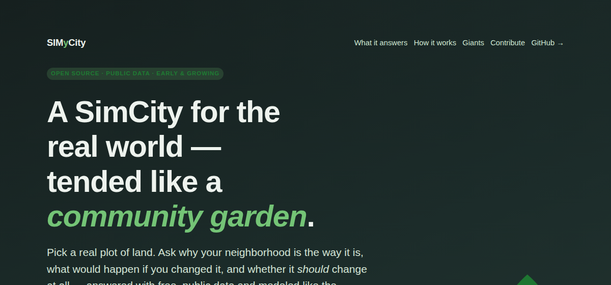

# SIMyCity



**A SimCity for the real world — built on public data, tended like a community garden.**

> 🗺️ **Try it:** the [**interactive explorer**](https://jodeit.github.io/simy_city/explore.html) — click a spot on the map,
> drop a development (data center, Costco, Chipotle, housing), and watch the model check what it
> needs, what it induces, the standoffs in the way, and whether it *should* be built. Runs entirely
> in your browser on live OpenStreetMap data.
> Once GitHub Pages is enabled it'll be live at **https://jodeit.github.io/simy_city/explore.html**.
>
> 🌱 **New here?** The [landing page](https://jodeit.github.io/simy_city/index.html) gives the guided tour and how to claim a plot.

The name is a play on words: **SimCity** (the simulation) + **"my / our city"**
— because this is meant to be tended by a community, not run by one owner. The
Python package is `simy_city`.

Pick a real parcel of land. Ask what would happen if you developed it for a
purpose. SIMyCity pulls together free, public data to answer three linked
questions:

1. **Why is the world the way it is here?** — *why hasn't Costco or Chipotle
   opened a location closer to me?* (And why aren't housing developers building
   the rooftops that would bring them?)
2. **What would happen if I changed it?** — *if I bought this plot and built a
   data center (or homes, or a store), would it succeed or fail, and what would
   it pull on?*
3. **Should it happen at all?** — the same parcel looks different to a developer,
   a resident, an environmentalist, and the city. SIMyCity holds those views in
   tension instead of collapsing them into one score.

What makes it more than a dashboard is three things modeled like the systems in
SimCity:

- **Dependencies.** A data center doesn't just need land — it needs **power,
  water, and broadband**. Available nearby? At what capacity? And what
  *second-order* demand does it induce — **schools, hospitals, fire stations** —
  at what scale? SIMyCity walks that graph (`simy use`).
- **Standoffs.** Retail won't come without rooftops; developers won't build
  rooftops without demand (jobs, amenities) — and retail *is* an amenity. These
  **chicken-and-egg loops** are often the real reason "nothing is here." SIMyCity
  finds them and names the cheapest way to break each one (`simy standoffs`).
- **Competing priorities.** "Should we?" is a values question, not a technical
  one. SIMyCity scores a use through every stakeholder's eyes and flags when a
  development is genuinely **contested** (`simy perspectives`).

> **Status:** early. This milestone delivers the **public-data source registry +
> research doc** — the catalog of free datasets everything else is built on,
> plus a working dependency model and a tiny CLI to explore it. See
> [`docs/`](docs/) and [`data_sources/`](data_sources/).

---

## The testbed: ZIP 78738 (Bee Cave / Lake Travis, TX)

We anchor the work on a concrete place: **78738**, the affluent but
low-density Hill Country west of Austin. It's a great stress test:

- **Retail:** It's *not* poor — so the absence of a warehouse club isn't about
  income. It's about **rooftops within a drive-time ring** and a road network
  cut up by the lake. That's exactly the kind of thing a model can surface.
- **Infrastructure:** It sits on the **ERCOT** grid, in drought-prone, flash-flood
  Hill Country with steep terrain — so the data-center dependency story (power +
  water + fiber + flood/slope constraints) is real and local.

Everything generalizes to any US address; we just prove it somewhere specific
first.

---

## How it works (the model)

Two YAML files in [`data_sources/`](data_sources/) are the heart of the system:

- **[`registry.yaml`](data_sources/registry.yaml)** — every public dataset we
  use: who publishes it, how to reach it (API / download / GIS service), auth,
  key fields, license, and **why it matters for 78738**.
- **[`layers.yaml`](data_sources/layers.yaml)** — the SimCity-style *service
  layers* (power, water, broadband, education, health, safety, demand, habitat,
  carbon, …) and the *land uses* you can "drop" on a parcel, with:
  - `requires` — hard inputs (a data center *requires* ≥20 MW power, ≥1 MGD
    water, redundant fiber, ≥10 buildable acres).
  - `induces` — second-order public-service demand it creates at a given scale
    (1,000 new homes *induce* school demand; 5,000 *induce* a new fire station).
  - `enabling_edges` — "X makes Y viable" links between uses, which create the
    chicken-and-egg **standoffs** ([`docs/feedback-loops.md`](docs/feedback-loops.md)).
  - `impacts` + `stakeholders` — each use's ecological/social cost, scored through
    competing viewpoints ([`docs/stakeholders.md`](docs/stakeholders.md)).

A small Python package ([`simy_city/`](simy_city/)) loads, **validates**, and
queries this model. Try it:

```bash
pip install -e .
simy report                       # source count per service layer (find thin spots)
simy layer power                  # which datasets feed the power layer
simy use data_center              # full dependency profile of a data center
simy standoffs                    # chicken-and-egg standoffs in the model
simy perspectives data_center     # "should we?" — leaning by stakeholder
simy todo                         # connectors a contributor could build next
```

**Run the web explorer locally:**

```bash
python tools/build_model_json.py          # compile the YAML model → web/model.js
python -m http.server -d web 8000         # then open http://localhost:8000/explore.html
```

To publish it: in the repo's **Settings → Pages**, set *Source = GitHub Actions*. The included
[`pages.yml`](.github/workflows/pages.yml) workflow rebuilds the model and deploys `web/` on every push to `main`.

## What's in the box now

| Piece | File | What it does |
|---|---|---|
| Data-source registry | `data_sources/registry.yaml` | 28 free public datasets, fully annotated |
| Service-layer + dependency model | `data_sources/layers.yaml` | layers, land uses, requires/induces, enabling edges, impacts, stakeholders |
| Loader / validator / query API | `simy_city/registry.py` | typed objects, schema validation |
| Standoff detector | `simy_city/standoffs.py` | finds chicken-and-egg loops + cheapest breaker |
| Stakeholder engine | `simy_city/perspectives.py` | scores "should we?" across competing POVs |
| CLI explorer | `simy_city/cli.py` | `simy report / layer / use / standoffs / perspectives / todo / validate` |
| Tests | `tests/test_registry.py` | CI guards the model |
| Interactive explorer | `web/explore.html` | click-a-map demo: drop a use, see needs/standoffs/should-we, live OSM |
| Model compiler | `tools/build_model_json.py` | YAML → `web/model.json`/`.js` (single source of truth for the viz) |
| Landing page | `web/index.html` | visual tour for collaborators (GitHub Pages-ready) |
| Personas / on-ramps | `docs/personas.md` | the value + contribution path for each kind of visitor |
| Prior art | `docs/prior-art.md` | the open-source giants we build on, credited |
| Research doc | `docs/data-sources.md` | the public-data landscape, narrated |
| Feedback loops | `docs/feedback-loops.md` | chicken-and-egg standoffs, explained |
| Stakeholders | `docs/stakeholders.md` | the "should we develop?" / competing-priorities model |
| Architecture | `docs/architecture.md` | how the analysis pipeline will work |
| Roadmap | `docs/roadmap.md` | milestones from registry → MVP → sim |
| Collaboration model | `docs/contributing.md` | community garden + spare-token agents |

## The collaboration idea

Two things make this a *community* project, not just a tool:

1. **Open like a community garden.** Anyone can add a data source, refine a
   dependency threshold (with a citation), or build a connector. The registry is
   plain YAML precisely so contributions are low-friction and reviewable.
2. **Semi-automated with spare Claude Code tokens.** Contributors can point
   *underutilized* agent capacity at a queue of well-scoped tasks (e.g. "build
   the connector for `fcc_bdc`") so the project advances while we sleep. The
   design for that — task format, guardrails, review gates — is in
   [`docs/contributing.md`](docs/contributing.md).

See **[`docs/roadmap.md`](docs/roadmap.md)** for where this goes next.

## License

Code: MIT. Each dataset carries its own license — see the `license` field on
every entry in `registry.yaml` (notably OpenStreetMap is ODbL: attribution +
share-alike).
